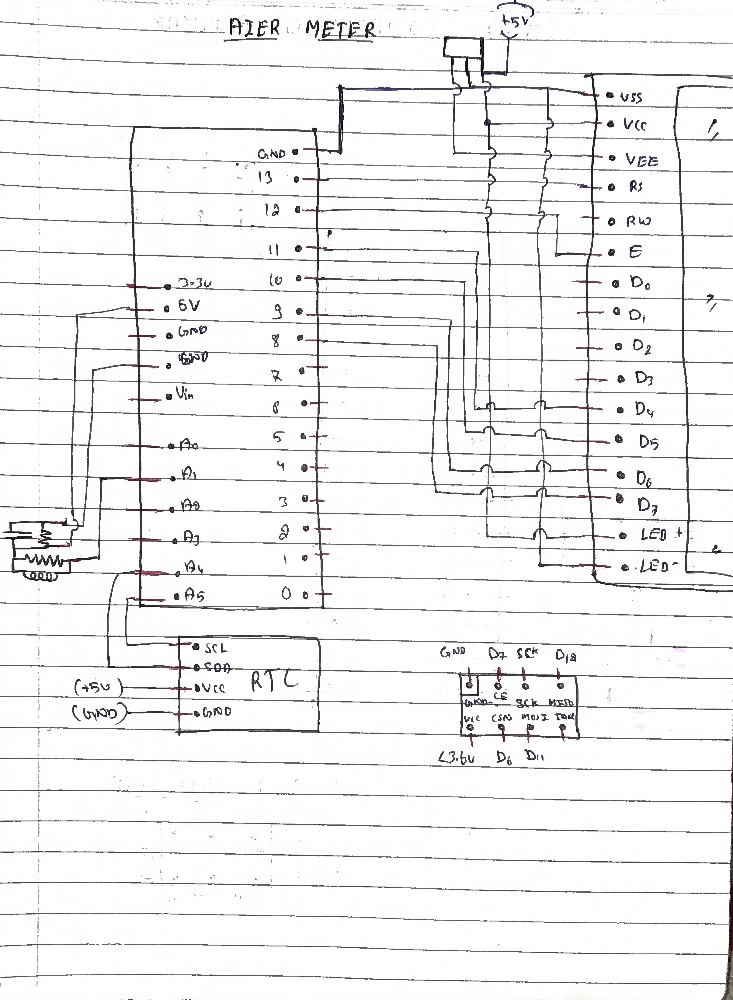
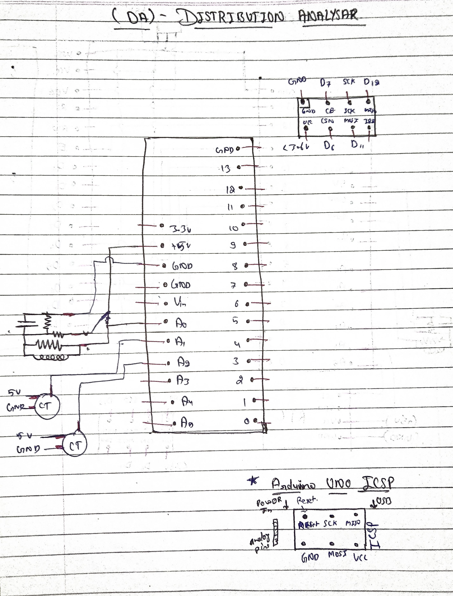
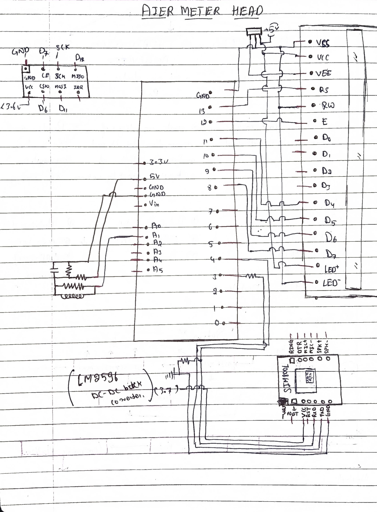
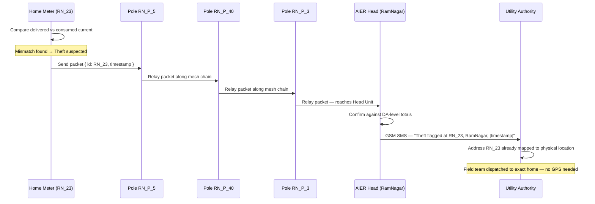
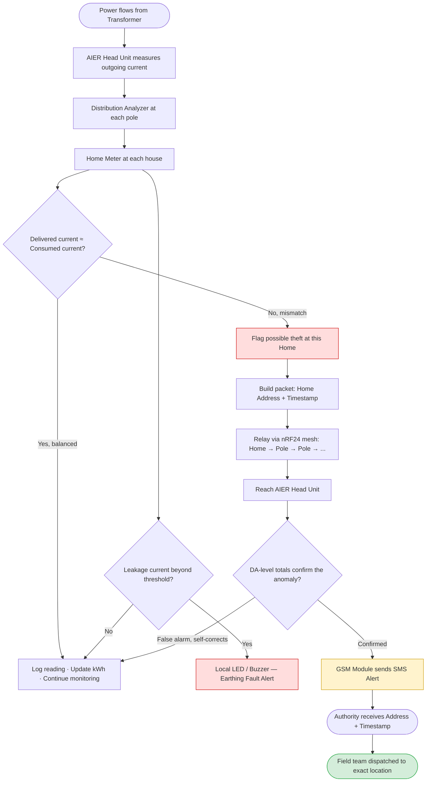

# ⚡ AIER Meter System
### Anti-Pilferage & Earthing-Health Monitoring Network for Rural & Hilly Power Grids

**Smart India Hackathon 2023 — Idea Submission**
**Problem Statement by:** Government of Jammu & Kashmir
**Team:** AIR Revolutionaries · B.Tech ECE, Semester 1

<p align="center">
  
  
  
</p>
<p align="center"><i>All three circuits were hand-drawn — we hadn't learned ECAD tools yet. Every line here was routed by hand, by first-semester students.</i></p>

---

## 🏔️ The Problem: Where Does J&K's Power Actually Go?

At SIH 2023, the **Government of Jammu & Kashmir** placed a number in front of us that we couldn't unsee: in hilly and remote terrain, **more than 50% of the electricity generated is lost before it reaches a billed customer.**

Some of that loss is technical — long transmission runs, poor earthing, terrain-driven inefficiency. But a large share is **pilferage**: illegal tapping straight off the line, in regions where the nearest inspector might be a mountain away.

Two failures compound each other:

- **No real-time visibility.** Utilities only see aggregate billing vs. generation *after* the losses have already piled up — by then there's no way to trace *where* it happened.
- **Faulty earthing goes undetected.** Weak or damaged earthing causes leakage current, shock hazards, and silent equipment damage, usually discovered only after something fails.

We didn't set out to build "a smart meter." We set out to answer one question: **when power goes missing, can we point to the exact pole, on the exact street, in real time — without GPS, without cellular coverage at every node, and without a rebuild of the grid?**

That question became the AIER Meter System.

---

## 💡 What We Built

AIER (Anti-pilferage / Earthing) is a **chain-connected network of custom current-sensing meters** that watches power at every hop of the distribution tree — home, pole, transformer — and flags the exact point where the numbers stop adding up.

| Device | What It Does | Where It Lives |
|---|---|---|
| **AIER Home Meter** | Measures a household's live current/power/kWh, watches for earthing leakage | Inside each home |
| **Distribution Analyzer (DA)** | Sums the current reported by every home meter beneath it and checks that sum against what the pole is actually delivering | Mounted on distribution poles / towers |
| **AIER Head Unit** | Aggregates every DA in a locality, confirms the fault, and fires the alert to the authority | Mounted at the transformer |

No GPS module. No per-device SIM card. Just **local addressing** — every device has a unique, human-readable ID already registered against a location in the utility's own database. When a fault packet carries that ID, the authority's system already knows exactly where it came from.

---

## ⚙️ Core Detection Logic

### 1. Power Theft — Detection by Comparison

Every device measures current through a **CT (Current Transformer) sensor**, samples it over 200 cycles per reading to find the peak, and derives RMS current → RMS power → cumulative kWh from that peak. The comparison logic is simple by design, because simple is what scales to thousands of homes cheaply:

```
IF   (Current delivered by a Pole/DA)  ≠  (Sum of all Home Meter currents beneath it)
THEN → Possible theft / illegal tap between the pole and the homes
```

The same check repeats one level up: the Head Unit compares the sum of all its DAs against what the transformer actually sent out. Theft anywhere in the tree breaks the balance at every level above it — which is exactly what makes it traceable.

### 2. Earthing Leakage — Detection by Threshold

Each Home Meter also watches the differential between its incoming and outgoing current legs. A gap beyond a safe threshold means current is escaping somewhere it shouldn't — a leakage/earthing fault — and the unit raises a local LED/buzzer alert immediately, independent of the network layer.

This two-signal design — **balance-based theft detection** and **threshold-based leakage detection** — is what let a first-semester team ship working hardware without needing SCADA-grade infrastructure.

---

## 📡 Communication Architecture — How a Fault Finds Its Way Home

This is the part we're proudest of, because it's the part we *hadn't* finished when we demoed — but had fully designed:

- **nRF24L01** modules link every home and every pole into a **local mesh chain** — no cellular needed at the edge.
- **One GSM module**, sitting only at the **Head Unit**, is the sole gateway to the outside world. It's the only device that needs a SIM.
- A fault report is a **tiny packet**: just a device address + a timestamp. Keeping it small keeps the chain fast, even hopping across dozens of poles.

### Worked Example — Colony "RamNagar"

Say RamNagar has 25 homes (`RN_01`…`RN_25`) fed by a chain of poles (`RN_P_1`…`RN_P_40`), all reporting up to one **AIER Head Unit** named `RamNagar`.



The packet doesn't need to know the way — it just needs to keep moving toward the Head. Every pole is a dumb relay except at the moment it's the source; the **intelligence lives in the comparison logic**, not in the routing. That's what keeps per-node cost low enough to deploy at scale across a hillside.

---

## 🔀 System Flow — Full Detection-to-Alert Pipeline



---

## 🧰 Hardware Used

- CT (Current Transformer) sensors — one per phase leg being monitored
- Arduino Uno / Nano — per-device compute
- 16×2 LCD — live current, power, and cumulative kWh display
- Buzzer + LED indicators — local leakage/fault signaling
- nRF24L01 modules — mesh relay (designed, wiring validated; full integration pending)
- GSM module — Head Unit's outbound alert channel (designed, pending integration)
- Breadboard + fully hand-drawn circuit layouts (no ECAD — see `docs/circuit_diagrams/`)

---

## 📁 Repository Structure

```
AIER-Meter-System/
│
├── Home_Meter/
│   └── AIR0214_Meter_PRGM.ino         # Home-level current/kWh + leakage detection
│
├── DA_Module/
│   └── AI_ER_DA_code.ino              # Pole-level comparison across multiple homes
│
├── Head_Unit/
│   └── (Planned: GSM alert + mesh aggregation — architecture complete, code pending)
│
├── docs/
│   ├── circuit_diagrams/              # Hand-drawn originals: Home Meter, DA, Head Unit
│   └── demo/                          # Photos / video captures of the working prototype
│
└── README.md
```

---

## 🎥 Demonstration

**Stage 1 — Current Measurement**
[Watch the demo](https://drive.google.com/file/d/1TRCFn7btSDsR3SVidfszVk2cfPGkqwwG/view?usp=drive_link)
Live current and power readout on the 16×2 LCD.

**Stage 2 — Fault Detection Added**
[Watch the demo](https://drive.google.com/file/d/13xh771XabVxoeucFKGbL0OeV8l5w-GpD/view?usp=sharing)
Same current measurement, now paired with a real-time LED fault indicator.

---

## ✅ What We Achieved

- A working **CT-based energy meter** with live RMS current, power, and cumulative kWh
- **Earthing leakage detection** with local alerting
- **Balance-based theft detection logic** across the Home → DA → Head hierarchy
- A complete, address-based (GPS-free) **fault-localization architecture**
- Fully hand-drawn circuit diagrams for all three device types, built with zero prior embedded experience

## 🔜 What's Left

- [ ] nRF24L01 mesh integration (wiring designed, code currently commented out pending testing)
- [ ] GSM-based SMS alerting at the Head Unit
- [ ] Authority-side dashboard mapping device addresses to physical locations
- [ ] PCB design and a weatherproof enclosure for pole/transformer mounting

---

## 👥 Team AIR Revolutionaries — SIH 2023

| Name | Role |
|---|---|
| **Jaideep Chouhan** | Team Lead — Embedded Programming & System Integration |
| **Jai Bhugra** | Circuit Design & Current Calibration |
| **Chintu Sahu** | Embedded Implementation & Module Replication |
| **Jangid Vinay Kumar** | Device Physical Design & Layout |
| **Mamta Bairwa** | Presentation & Concept Communication |
| **Lareb** | Debugging Support & Documentation |

> We were six first-semester students with zero prior embedded systems experience, tackling a problem statement from a real state government. We learned CT sensing, RMS calculation, LCD interfacing, and mesh-network design *while* building this — not before.

---

## 🌱 Why This Project Matters to Us

This was our first attempt at turning a real government problem statement into working hardware. It isn't finished, and we knew going in that a semester-one team wasn't going to ship a production grid-monitoring system.

What we did ship: a real CT-based meter that measures live power, a leakage detector that catches earthing faults, a theft-detection method that needs no GPS, and a communication architecture built for terrain where connectivity can't be taken for granted.

More than the hardware, this project taught us how to read a problem statement, break it into a system, and keep building even when we didn't yet have the tools everyone else already knew.

---

<p align="center"><i>Built with soldering irons, hand-drawn schematics, and no ECAD software — RamNagar edition. 🇮🇳</i></p>
